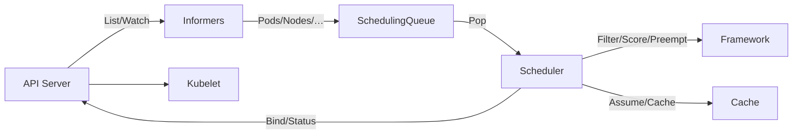
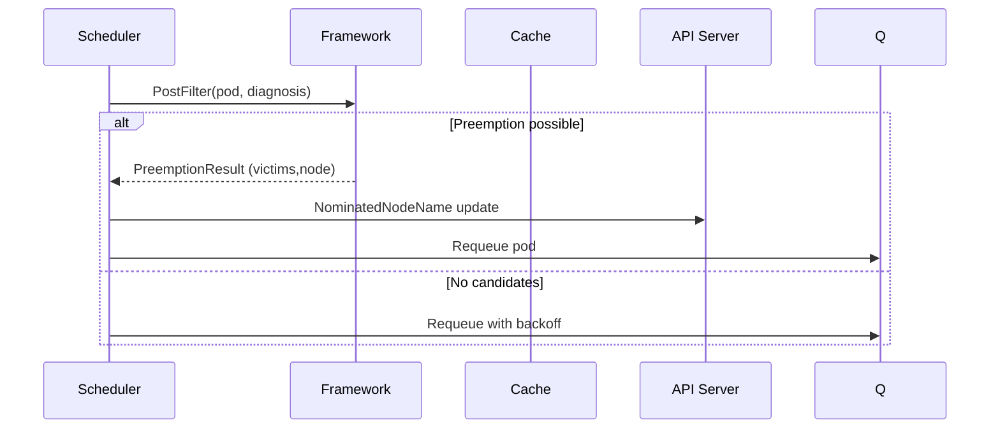

# Scheduler Functional Spec

High-level flow


Scheduling/binding cycle (`pkg/scheduler/schedule_one.go`)
- Pop next Pod (`SchedulingQueue.Pop`).
- Build `CycleState`; run phases via Framework: PreFilter → Filter → (PreScore → Score → NormalizeScore) → Reserve → Permit → PreBindPreFlight → PreBind → Bind → PostBind.
- On success: assume Pod in cache, continue asynchronously to bind; on failure: run PostFilter (preemption) and requeue.

Source links
- Core loop: `pkg/scheduler/schedule_one.go`, `pkg/scheduler/scheduler.go`
- Event handlers: `pkg/scheduler/eventhandlers.go` (moves pods across queues on cluster events)
- Queues: `pkg/scheduler/backend/queue/scheduling_queue.go`
- Cache and snapshot: `pkg/scheduler/backend/cache/cache.go`, `pkg/scheduler/backend/cache/snapshot.go`
- Extenders: `pkg/scheduler/extender.go`

Queueing and backoff (`pkg/scheduler/backend/queue/scheduling_queue.go`)
- Three pools: `activeQ`, `backoffQ`, `unschedulablePods`.
- Plugins register ClusterEvents and QueueingHints; events move Pods back to `activeQ` or `backoffQ` intelligently.
- Backoff uses exponential delays with min/max bounds; periodic goroutine flushes leftovers.

Embedded diagrams
```mermaid
%% Scheduling sequence
sequenceDiagram
  participant PI as Pod Informer
  participant Q as SchedulingQueue
  participant S as Scheduler
  participant F as Framework
  participant C as Cache
  participant X as Extenders
  participant API as API Server
  participant K as Kubelet

  PI->>Q: Add unscheduled Pod
  loop Schedule loop
    Q->>S: Pop QueuedPodInfo
    S->>F: New CycleState
    S->>C: UpdateSnapshot (immutable view)
    S->>F: PreFilter(pod)
    par per-node filtering
      F->>F: Filter(node)
    end
    alt no feasible nodes
      S->>F: PostFilter (may Preempt)
      F-->>S: NominatingInfo (optional)
      S->>Q: Requeue (backoff/active)
      continue
    end
    S->>F: PreScore/Score/Normalize
    S->>X: (optional) Extender score
    S->>S: selectHost()
    S->>C: Assume(pod,node)
    S->>F: Reserve/Permit
    par Bind asynchronously
      S->>F: PreBindPreFlight/PreBind
      S->>API: Bind(pod->node)
      API-->>K: Pod assigned
      S->>F: PostBind
      S->>C: FinishBinding/Forget on failure
    end
  end
```

```mermaid
%% Queue activity
stateDiagram-v2
  [*] --> ActiveQ
  ActiveQ: New pods; moved after backoff
  BackoffQ: Exponential delay per pod
  Unschedulable: Pods failed Filter/PostFilter

  ActiveQ --> Sched: Pop()
  Sched --> Unschedulable: Failure (with plugin causes)
  Unschedulable --> BackoffQ: Event triggers, backoff remaining
  Unschedulable --> ActiveQ: Event triggers, skip backoff
  BackoffQ --> ActiveQ: Backoff window elapsed

  note right of Unschedulable
    QueueingHints guide whether events
    move pods immediately or after backoff
  end note
```





Preemption path
- When no Node fits, PostFilter may preempt: select victims on a candidate Node, update `NominatedNodeName`, and requeue.

Extensibility
- Scheduling Framework (`pkg/scheduler/framework`): extension points define plugin contracts; profiles configure plugin sets.
- Extenders (`pkg/scheduler/extender.go`): optional HTTP external filters/scorers; run after in-tree filters and before final host selection.

Related diagrams
- See `diagrams/scheduling-sequence.mmd`, `diagrams/queue-activity.mmd`, and `diagrams/preemption-sequence.mmd`.
 - See also plugins: `plugins-and-profiles.md` and catalog: `plugins-catalog.md`.
