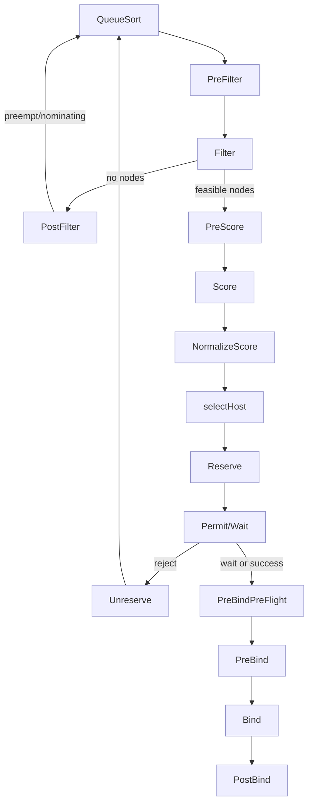

# Plugins and Profiles Deep Dive

Extension points (execution order)
- PreEnqueue: gate/prepare pods before queueing; can skip enqueue. Sources: SchedulingGates, DynamicResources, DefaultPreemption.
- QueueSort: sort function for `SchedulingQueue` (default: `PrioritySort`).
- PreFilter: compute pod/node prerequisites; may reduce candidate nodes via `PreFilterResult`.
- Filter: per-node hard checks (taints/affinity/resources/ports/volumes).
- PostFilter: optional actions when no node fits (e.g., preemption) and return `NominatingInfo`.
- PreScore → Score → NormalizeScore: compute and scale node scores; higher is better; weights applied per plugin.
- Reserve/Unreserve: manage in-memory reservations; roll back on failure.
- Permit/WaitOnPermit: asynchronous gate; may wait or reject; coordinates with binding cycle.
- PreBindPreFlight/PreBind: finalize requirements (e.g., PV binding) before binding.
- Bind: choose a binder (default `DefaultBinder`) or out-of-tree bind.
- PostBind: notifications/cleanup after a successful bind.

Default in-tree plugins and weights (v1, expanded)
- QueueSort: PrioritySort
- PreFilter: NodeAffinity, NodePorts, NodeResourcesFit, VolumeRestrictions, NodeVolumeLimits, VolumeBinding, VolumeZone, PodTopologySpread, InterPodAffinity, DynamicResources
- Filter: NodeUnschedulable, NodeName, TaintToleration, NodeAffinity, NodePorts, NodeResourcesFit, VolumeRestrictions, NodeVolumeLimits, VolumeBinding, VolumeZone, PodTopologySpread, InterPodAffinity, DynamicResources
- PostFilter: DynamicResources, DefaultPreemption
- PreScore: TaintToleration, NodeAffinity, NodeResourcesFit, VolumeBinding, PodTopologySpread, InterPodAffinity, NodeResourcesBalancedAllocation
- Score (weights): TaintToleration(3), NodeAffinity(2), NodeResourcesFit(1), VolumeBinding(1), PodTopologySpread(2), InterPodAffinity(2), NodeResourcesBalancedAllocation(1), ImageLocality(1)
- Reserve: VolumeBinding, DynamicResources; PreBind: VolumeBinding, DynamicResources; Bind: DefaultBinder

Notable plugin behavior
- TaintToleration: filters by taints; also scores to avoid tainted nodes.
- NodeAffinity/InterPodAffinity: enforce node and inter-pod constraints; score to prefer matches.
- NodeResourcesFit/NodeResourcesBalancedAllocation: enforce/optimize CPU/memory fit and balance.
- VolumeBinding/VolumeRestrictions/NodeVolumeLimits/VolumeZone: ensure PVC/PV topology and limits; may bind volumes in PreBind.
- PodTopologySpread: enforce default/explicit spreading across topology domains.
- DefaultPreemption: picks victims and sets `NominatedNodeName` when needed.
- DynamicResources: participates across phases for dynamic resource allocation (ResourceClaims/Slices).
- NodeUnschedulable/NodeName: quick filters for node readiness or direct binding.
- DefaultBinder: performs the actual Pod->Node Bind via API.

Profiles and queue sorting
- Each profile (keyed by `schedulerName`) has its own plugin stack and `QueueSortFunc` used to order pods in the shared queue.
- `pkg/scheduler/profile` wires a `framework.Framework` per profile; `ListPlugins().QueueSort.Enabled[0].Name` determines sorting.
- Multiple profiles can coexist; pods target a profile via `spec.schedulerName`.

Configuration examples (YAML)
```yaml
apiVersion: kubescheduler.config.k8s.io/v1
kind: KubeSchedulerConfiguration
profiles:
- schedulerName: default-scheduler
  plugins:
    score:
      disabled:
      - name: ImageLocality
      enabled:
      - name: NodeResourcesFit
        weight: 2
    bind:
      disabled:
      - name: DefaultBinder
      enabled:
      - name: MyBinder
  pluginConfig:
  - name: NodeResourcesFit
    args:
      scoringStrategy:
        type: LeastAllocated
        resources:
        - name: cpu
          weight: 1
        - name: memory
          weight: 1
```

Extenders vs. framework
- Extenders are external HTTP services that can Filter/Score after in-tree filters and before host selection; they cannot participate in QueueingHints or Reserve/Bind.
- Prefer framework plugins for tight integration and performance; use extenders only when external systems must decide placement.

Diagrams
- See `diagrams/plugins-flow.mmd` for the extension point order and bindings.

Embedded diagram


Default profile plugin index (v1)
```mermaid
flowchart TB
  subgraph QueueSort
    QS[PrioritySort]
  end
  subgraph PreFilter
    PFa[NodeAffinity]
    PFp[NodePorts]
    PFr[NodeResourcesFit]
    PFv1[VolumeRestrictions]
    PFv2[NodeVolumeLimits]
    PFvb[VolumeBinding]
    PFvz[VolumeZone]
    PFpts[PodTopologySpread]
    PFipa[InterPodAffinity]
    PFdra[DynamicResources]
  end
  subgraph Filter
    Fnu[NodeUnschedulable]
    Fnn[NodeName]
    Ftt[TaintToleration]
    Fna[NodeAffinity]
    Fnp[NodePorts]
    Fnr[NodeResourcesFit]
    Fvr[VolumeRestrictions]
    Fnvl[NodeVolumeLimits]
    Fvb[VolumeBinding]
    Fvz[VolumeZone]
    Fpts[PodTopologySpread]
    Fipa[InterPodAffinity]
    Fdra[DynamicResources]
  end
  subgraph PostFilter
    PoFdra[DynamicResources]
    PoFdp[DefaultPreemption]
  end
  subgraph PreScore
    PStt[TaintToleration]
    PSna[NodeAffinity]
    PSnr[NodeResourcesFit]
    PSvb[VolumeBinding]
    PSpts[PodTopologySpread]
    PSipa[InterPodAffinity]
    PSnba[NodeResourcesBalancedAllocation]
  end
  subgraph Score
    Stt[TaintToleration (3)]
    Sna[NodeAffinity (2)]
    Snr[NodeResourcesFit (1)]
    Svb[VolumeBinding (1)]
    Spts[PodTopologySpread (2)]
    Sipa[InterPodAffinity (2)]
    Snba[NodeResourcesBalancedAllocation (1)]
    Sil[ImageLocality (1)]
  end
  subgraph Reserve
    Rvb[VolumeBinding]
    Rdra[DynamicResources]
  end
  subgraph PreBind
    PBvb[VolumeBinding]
    PBdra[DynamicResources]
  end
  subgraph Bind
    Bdb[DefaultBinder]
  end
```
