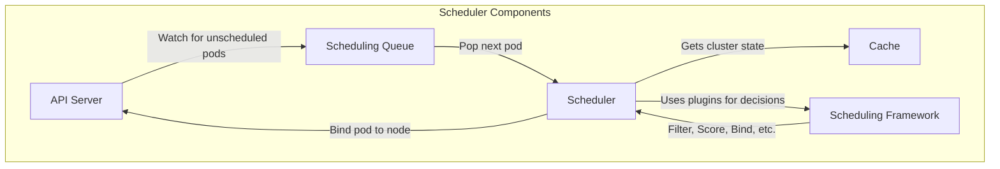

# Kubernetes Scheduler Architecture: High-Level Overview

This document provides a high-level overview of the Kubernetes scheduler's architecture.

## 1. Entry Point

The scheduler's execution begins in `cmd/kube-scheduler/scheduler.go`. The `main` function in this file calls `app.NewSchedulerCommand()` from the `cmd/kube-scheduler/app/server.go` package, which is responsible for initializing and running the scheduler.

## 2. Main Components

The Kubernetes scheduler is composed of several key components that work together to assign pods to nodes.

### 2.1. Scheduler (`pkg/scheduler/scheduler.go`)

The **Scheduler** is the central component that orchestrates the entire scheduling process. It contains the main scheduling loop, which continuously fetches the next pod from the scheduling queue and attempts to find a suitable node for it.

### 2.2. Scheduling Queue (`pkg/scheduler/backend/queue/scheduling_queue.go`)

The **Scheduling Queue** holds all pods that are waiting to be scheduled. It is implemented as a priority queue, which means that pods with higher priority are scheduled first. The queue is composed of three sub-queues:

*   **activeQ**: Holds pods that are ready to be scheduled.
*   **backoffQ**: Holds pods that have failed scheduling and are waiting for a backoff period to complete before being moved back to the activeQ.
*   **unschedulablePods**: Holds pods that have been deemed unschedulable.

### 2.3. Cache (`pkg/scheduler/backend/cache/cache.go`)

The scheduler maintains an internal **Cache** of the cluster's state, including information about nodes and pods. This cache is kept up-to-date using informers that watch the API server for changes. By using a cache, the scheduler can make scheduling decisions without repeatedly querying the API server, which significantly improves performance.

### 2.4. Scheduling Framework (`pkg/scheduler/framework/interface.go`)

The **Scheduling Framework** provides a pluggable architecture that allows for extensive customization of the scheduling process. It defines a series of extension points, each corresponding to a different phase of the scheduling cycle. Plugins can be registered at these extension points to add or modify scheduling behavior.

## 3. The Scheduling Cycle (`pkg/scheduler/schedule_one.go`)

The scheduling of a single pod is performed in the `scheduleOne` function. This function represents the core of the scheduling process and can be broken down into the following steps:

1.  **Next Pod**: The scheduler retrieves the next pod to be scheduled from the scheduling queue.
2.  **Filtering**: The scheduler runs a set of "Filter" plugins to identify the nodes where the pod can run. These plugins check for various constraints, such as resource availability, node selectors, and affinity/anti-affinity rules.
3.  **Scoring**: After filtering, the scheduler runs a set of "Score" plugins to rank the feasible nodes. Each plugin assigns a score to each node, and the scores are then combined to produce a final ranking.
4.  **Binding**: The scheduler selects the node with the highest score and binds the pod to it by making a request to the API server.

This concludes the high-level overview of the Kubernetes scheduler's architecture. The next section will delve deeper into the details of the scheduling cycle.
