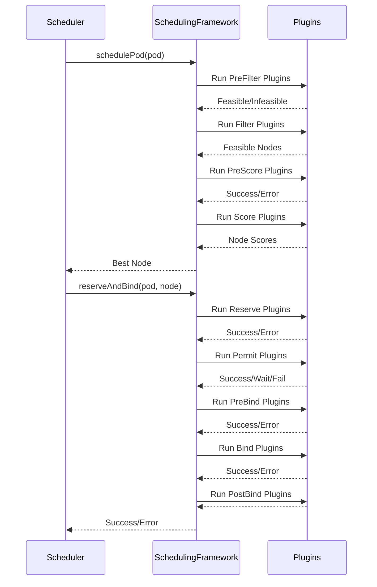

# Kubernetes Scheduler Architecture: The Scheduling Cycle

This document details the scheduling cycle, the process of assigning a single pod to a suitable node. The entire workflow is orchestrated by the `scheduleOne` function in `pkg/scheduler/schedule_one.go`.

## 1. The `scheduleOne` Function

The `scheduleOne` function is the heart of the scheduler. It is responsible for the following steps:

1.  **Get Next Pod**: Retrieves the next pod to be scheduled from the priority queue.
2.  **Run Scheduling Cycle**: Executes the filtering and scoring phases to find the best node for the pod.
3.  **Reserve & Bind**: If a suitable node is found, it reserves the resources and binds the pod to the node.

## 2. The Scheduling Framework

The scheduling cycle is implemented using a pluggable architecture called the **Scheduling Framework**. The framework defines a series of extension points, and plugins can be registered to customize the scheduling logic at each stage.

## 3. Phases of the Scheduling Cycle

The scheduling cycle consists of several phases, each with its own set of plugins.

### 3.1. Filtering

In the filtering phase, the scheduler identifies the set of nodes where the pod can be scheduled. This is a two-step process:

1.  **PreFilter**: These plugins perform initial checks and can preemptively filter out nodes. For example, a plugin might check if the pod has any specific node requirements.
2.  **Filter**: These plugins perform the main filtering logic. Each plugin is called for each node, and if any plugin marks a node as infeasible, the node is removed from consideration.

If no nodes are found to be feasible, the pod is considered unschedulable.

### 3.2. Scoring

Once the list of feasible nodes is determined, the scoring phase ranks the nodes to find the best fit for the pod.

1.  **PreScore**: These plugins can perform any necessary pre-processing before the scoring begins.
2.  **Score**: Each scoring plugin assigns a score to each feasible node. The scores from all plugins are then combined to produce a final score for each node.

### 3.3. Reserving & Binding

After the best node is selected, the scheduler proceeds to the binding phase.

1.  **Reserve**: This is an informational plugin that can be used to update the state of the scheduler before the pod is bound.
2.  **Permit**: These plugins can prevent or delay the binding of a pod. A permit plugin can return one of three results:
    *   **Success**: The pod is allowed to be bound.
    *   **Wait**: The scheduler will wait for a specified duration before retrying.
    *   **Fail**: The pod is rejected.
3.  **PreBind**: These plugins are called before the pod is bound. They can be used to perform any necessary setup, such as creating network resources.
4.  **Bind**: This plugin is responsible for binding the pod to the node by making a request to the API server.
5.  **PostBind**: These plugins are called after the pod has been successfully bound. They can be used for cleanup tasks.

This detailed breakdown of the scheduling cycle provides a clear understanding of how the Kubernetes scheduler works. The next section will explore the key data structures used in the scheduler.
